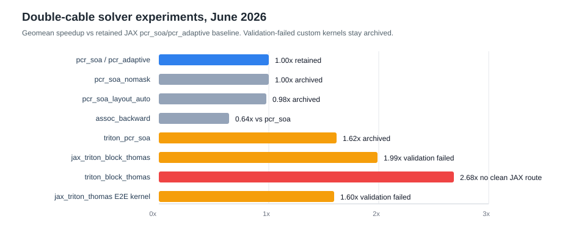

# Double-Cable Solver Optimization Summary, June 2026

This report closes the June 2026 double-cable solver optimization pass. The
short version: keep the public solver surface unchanged, archive the custom
kernel spikes, and move the next performance work to `Vext` materialization and
workflow-level benchmarks.



## Final Decision

Retained active solver routes:

- `auto`
- `thomas`
- `pcr`
- `pcr_soa`
- `pcr_adaptive`

No new GPU full-batch double-cable solver is routed by default. The best isolated
custom-kernel signals were real, especially Triton block Thomas, but none cleared
the integration and validation gates required for production AxonScope use.

## Evidence Table

| Candidate | Main evidence | Performance result | Validation / risk | Decision |
|---|---:|---:|---|---|
| `pcr_soa` / `pcr_adaptive` | baseline retained route | `1.00x` reference | current public route | Keep |
| `pcr_soa_nomask` | P100 `20260617_220929_linear_pcr_soa_nomask_focus_NvidiaTeslaP100` | `1.001x` runtime vs `pcr_soa`, `2/4` wins | algebra unchanged, no useful gain | Archive |
| `pcr_soa_shift` | same P100 run | `1.786x` runtime vs `pcr_soa`, `0/4` wins | slower despite simpler HLO | Archive |
| `pcr_soa_layout_auto` | P100 `20260618_202917_linear_pcr_soa_layout_focus_NvidiaTeslaP100` | `1.021x` runtime vs `pcr_soa`, `2/6` wins | layouts identical to baseline | Archive |
| `pcr_soa_ref` | same P100 run | `1.033x` runtime vs `pcr_soa`, `0/6` wins | internal refs did not help | Archive |
| `assoc_backward` | P100 `20260618_182820_linear_assoc_focus_NvidiaTeslaP100` | `1.385x` faster than `thomas_batched`, but `1.570x` runtime vs `pcr_soa` | exact candidate, not competitive | Archive |
| split iterative `split_gs_*` | P100 linear/E2E split focus + local agreement | fast in solver-only cases | failed trace/physiology agreement | Abandon |
| Pallas Thomas / PCR spikes | P100/T4 Pallas focus runs through `20260618_200242_linear_pallas_focus_NvidiaTeslaT4` | no stable timing on current stack | Mosaic GPU limitations on P100/T4; T4 old-stack notebook only | Standby |
| standalone `triton_block_thomas` | T4 `20260618_205135_linear_triton_focus_NvidiaTeslaT4` | `2.684x` geomean speedup vs JAX `pcr_soa` | pure Triton/Torch path, not a clean JAX time-loop route | Archive for evidence |
| standalone `triton_pcr_soa` | T4 `20260618_210243_linear_triton_focus_NvidiaTeslaT4` | `1.619x` vs JAX `pcr_soa`; `1.697x` slower than Triton Thomas | no reason to pursue over Thomas | Archive |
| DLPack/Torch bridge | T4 `20260618_214520_linear_triton_focus_NvidiaTeslaT4` | only `1.060x` vs JAX, `2.522x` slower than pure Triton | host/framework bridge overhead too high | Archive |
| `jax_triton_block_thomas` | T4 `20260618_221506_linear_jax_triton_focus_NvidiaTeslaT4` | `1.991x` geomean speedup vs JAX `pcr_soa` | promising isolated solver | Archive until validation solved |
| `jax_triton_thomas` E2E | T4 `20260618_223213_e2e_jax_triton_focus_NvidiaTeslaT4` | `1.595x` geomean E2E kernel speedup, `7/8` wins | failed strict Vm agreement gates | Archive |

## Validation Notes

The JAX-Triton bridge was the closest custom-kernel route to a usable AxonScope
integration, but it did not pass the physiology agreement gate:

- `20260618_224225_validate_jax_triton_focus_NvidiaTeslaT4`: `0/16` rows passed
  strict thresholds versus `pcr_adaptive`; max absolute Vm error ranged from
  `0.041` to `102.583 mV`, with up to `2` extra activations.
- `20260618_224837_validate_jax_triton_thomas_focus_NvidiaTeslaT4`: `0/8` rows
  passed strict thresholds versus Thomas. `jax_triton_thomas` preserved
  activation counts on these cases, but still had max absolute Vm errors up to
  `95.508 mV`.

That makes the current conclusion conservative: the custom kernels are useful
evidence and future material, but not production solver routes.

## Code Organization After Cleanup

Active code remains under:

- `src/axonscope/solvers/`
- `benchmark/solvers/`
- `benchmark/kaggle/`

Archived or reproduction-only code lives under:

- `benchmark/archived_solver_spikes/`
- `benchmark/triton_solver/`
- `benchmark/jax_triton_solver/`
- `benchmark/cuda_ffi_solver/`
- `tests/archive/solver_spikes/`

The active Kaggle wrapper accepts only:

- `smoke`
- `linear`
- `linear_pcr_soa_trace`
- `e2e`
- `e2e_full`
- `both`
- `realistic_smoke`
- `realistic`
- `realistic_stress`

## Recommended Next Performance Target

The E2E runs repeatedly showed that dense `Vext` materialization and input
movement dominate many realistic cases once the solver route is reasonably fast.
The next optimization campaign should focus on `Vext`, not another solver spike.

The new workflow benchmark for that pass is:

```bash
python benchmark/realistic_examples/bench_basic_examples.py \
  --preset standard \
  --platforms cpu gpu \
  --run-counts 2 5 10 \
  --family-counts 5 25 50 \
  --repeats 3 \
  --warmups 1
```

Suggested next phases:

1. Add realistic workflow benchmarks for examples 6/7/8 to measure CPU vs GPU
   wall time, compile time, input generation, `Vext`, solve/runtime, and outputs.
2. Profile `Vext` materialization by batch size, fiber morphology, recording
   mode, and stimulation pattern.
3. Avoid dense `Vext` when possible: lazy/on-device generation, compressed
   electrode/stimulus representation, chunked batches, and reuse across runs.
4. Re-run E2E only after `Vext` changes, using `pcr_adaptive` as the retained
   GPU solver baseline.

## Realistic Stress Profiling Update

Kaggle P100 run
`20260619_093205_realistic_stress_NvidiaTeslaP100` adds CPU-vs-GPU profiling for
examples 06/07/08 with the stress preset and `--profile` enabled. It writes the
main timing tables plus event-level profile comparisons under:

- `realistic_examples_cpu_vs_gpu.csv`
- `realistic_examples_cpu_profile.csv`
- `realistic_examples_gpu_profile.csv`
- `realistic_examples_profile_cpu_vs_gpu.csv`
- `realistic_examples_cpu_vs_gpu_speedup.svg/png`

Aggregate warm-run wall time across the 14 stress cases was `72.58 s` on CPU and
`43.04 s` on GPU, a `1.69x` GPU speedup. First-run time still favored CPU
overall because GPU setup/compile/dispatch costs were larger: `213.27 s` CPU vs
`285.74 s` GPU.

Warm-run speedups by workflow:

- Example 06 velocity: strong GPU wins, `2.37x-3.02x` for HH and
  `3.18x-3.64x` for MRG.
- Example 07 threshold: small to moderate wins, from near parity to `1.76x`.
- Example 08 recruitment: GPU is slower, `0.72x-0.78x`.

The detailed profile makes the bottleneck clearer than the wall-time table:

| Warm event | CPU total | GPU total | CPU/GPU |
|---|---:|---:|---:|
| `kernel.wait` | `151.01 s` | `2.27 s` | `66.40x` |
| `kernel.enqueue` | `10.78 s` | `44.34 s` | `0.24x` |
| `runtime.prepare` | `12.48 s` | `36.54 s` | `0.34x` |
| `inputs.extracellular` | `2.97 s` | `2.07 s` | `1.44x` |
| `results.split_batch` | `0.23 s` | `1.65 s` | `0.14x` |

This shifts the immediate interpretation: for this stress matrix, dense
extracellular input generation is visible but not the dominant measured cost.
The GPU wins the actual solve/wait path, while `runtime.prepare` and
`kernel.enqueue` dominate the remaining GPU overhead, especially for repeated
protocol workflows such as recruitment.

Dispatch scheduling should therefore stay as a separate later phase. The stress
run mostly shows one dispatch group per simulation call, except mixed
recruitment cases with two groups (`single` and `double`). Current evidence
points first to reusing prepared runtimes and protocol-level batching/caching;
group coalescing and async scheduling become attractive once benchmarks show
many small compatible groups or memory-bound scheduling pressure.

The memory signal is also modest at this scale. For example, recruitment
`B=100` uses two groups of `50` fibers with `Nx=61` and `Nx=22`; the recorded
`Vstim` and `Vm` arrays are only a few MiB per protocol step on a P100 16 GB.
The planned scheduler phase should still include explicit hardware-memory
capacity checks, but this run is not yet capacity-limited.

## Runtime/Vext First Pass

The first Phase 7.6.5 implementation pass adds conservative runtime and Vext
reuse without changing the public API:

- Batch execution now passes the `solver_axon` already built by the dispatcher
  into `prepare_solver_runtime`, avoiding duplicate solver-axon construction.
- `prepare_solver_runtime` caches whole runtimes only for batch-safe calls where
  stimulation callables and precomputed drive tensors are deliberately excluded.
  This keeps amplitude sweeps correct while making repeated protocol runs
  cheaper.
- The shared analytical point-source path caches the spatial footprint and
  still recomputes the temporal current waveform for the current amplitude.
- Realistic profile CSVs now include selected raw-event metadata columns:
  `memory_estimate_total_nbytes_max`, `memory_estimate_total_mib_max`,
  `device_memory_capacity_bytes_max`, `memory_estimate_device_fraction_max`,
  `vstim_footprint_cache_hits`, and `vstim_footprint_cache_misses`.

Local smoke evidence:

- `benchmark/results/realistic_examples/local_runtime_cache_smoke_local_smoke_profile.csv`
- Targeted unit coverage: runtime cache reuse, live stimulus amplitudes with the
  footprint cache, and per-group memory metadata in benchmark events.

The next useful evidence run is the Kaggle P100 `realistic_stress` CPU-vs-GPU
profile again, comparing `runtime.prepare`, `inputs.extracellular`,
`kernel.enqueue`, and warm wall time against
`20260619_093205_realistic_stress_NvidiaTeslaP100`.

Kaggle P100 validation run
`20260619_195351_realistic_stress_NvidiaTeslaP100` used commit `084d8d4` and
completed successfully. Compared with the previous P100 stress run:

| Metric | Before | After | Change |
|---|---:|---:|---:|
| CPU warm total | `72.58 s` | `60.31 s` | `-16.9%` |
| GPU warm total | `43.04 s` | `36.99 s` | `-14.1%` |
| CPU first-run total | `213.27 s` | `176.99 s` | `-17.0%` |
| GPU first-run total | `285.74 s` | `241.79 s` | `-15.4%` |
| GPU `runtime.prepare` warm total | `36.54 s` | `29.54 s` | `-19.1%` |
| GPU `inputs.extracellular` warm total | `2.07 s` | `1.63 s` | `-21.3%` |
| GPU `kernel.enqueue` warm total | `44.34 s` | `41.08 s` | `-7.4%` |

The profile CSVs now expose memory/cache columns in
`realistic_examples_cpu_profile.csv` and `realistic_examples_gpu_profile.csv`.
The CPU/GPU comparison CSV still keeps the compact timing-only schema. In the
new run, the point-source footprint cache recorded `124` hits and `4` misses per
platform, and the largest per-group memory estimate was about `1146.8 MiB`
(`~9.4%` of the JAX-reported device memory limit for HH B=20), still below
memory pressure for the P100 stress matrix.

## Observer-Only Recruitment Pass

The `20260619_195351` profile showed that the remaining GPU issue is not device
solve time: `kernel.wait` is small, while repeated protocol enqueue, runtime
preparation, and result materialization dominate. For activation/recruitment
protocols that only need a boolean activation decision, moving full `Vm` traces
back to host is unnecessary.

Implemented follow-up:

- `find_activation_threshold_curve` and `recruitment_sweep` now route compatible
  `ActivationCriterion` evaluations through solver-side `Activation` observers
  when `recording` is `None` or `Recording.none()`.
- The realistic example 08 benchmark now exposes an explicit
  `--example08-recording full|observer_only` switch. The default `full` mode
  keeps CPU/GPU comparisons fair, while `observer_only` measures the compact
  solver-side activation path on both backends.
- Kaggle now has a separate `realistic_stress_observer` target. Early evidence
  shows the CPU observer-only stress path can exceed Kaggle's LLVM compile
  memory at `example08_recruitment`; the Kaggle target therefore applies
  low-memory CPU XLA/LLVM codegen flags and chunks CPU example 08 observer-only
  runs into smaller sub-batches.
- Explicit user recording requests such as probe recordings still keep the old
  post-hoc path, so probe-limited semantics are preserved.

Local validation:

- `pytest -q tests/unit/test_protocols.py tests/unit/test_public_api_facade.py tests/unit/test_realistic_examples_benchmark.py`
  passed with `47` tests.
- Local recruitment smoke:
  `benchmark/results/realistic_examples/local_observer_recruitment_smoke_local_observer_smoke_profile.csv`.
  On the mini CPU smoke, the per-group memory estimate for recruitment is about
  `0.075 MiB`, confirming that the full `Vm` tensor is no longer the retained
  protocol output.

Next evidence run: Kaggle P100 `realistic_stress`, compared against
`20260619_195351_realistic_stress_NvidiaTeslaP100`, especially
`example08_recruitment`, `results.split_batch`, memory estimates, and
`kernel.enqueue`.

## Result Folders

Key source folders used for this report:

- `benchmark/results/kaggle/20260617_220929_linear_pcr_soa_nomask_focus_NvidiaTeslaP100`
- `benchmark/results/kaggle/20260618_182820_linear_assoc_focus_NvidiaTeslaP100`
- `benchmark/results/kaggle/20260618_202917_linear_pcr_soa_layout_focus_NvidiaTeslaP100`
- `benchmark/results/kaggle/20260618_205135_linear_triton_focus_NvidiaTeslaT4`
- `benchmark/results/kaggle/20260618_210243_linear_triton_focus_NvidiaTeslaT4`
- `benchmark/results/kaggle/20260618_214520_linear_triton_focus_NvidiaTeslaT4`
- `benchmark/results/kaggle/20260618_221506_linear_jax_triton_focus_NvidiaTeslaT4`
- `benchmark/results/kaggle/20260618_223213_e2e_jax_triton_focus_NvidiaTeslaT4`
- `benchmark/results/kaggle/20260618_224225_validate_jax_triton_focus_NvidiaTeslaT4`
- `benchmark/results/kaggle/20260618_224837_validate_jax_triton_thomas_focus_NvidiaTeslaT4`
- `benchmark/results/kaggle/20260619_093205_realistic_stress_NvidiaTeslaP100`
- `benchmark/results/kaggle/20260619_195351_realistic_stress_NvidiaTeslaP100`
- `benchmark/results/realistic_examples/local_runtime_cache_smoke_local_smoke_profile.csv`
- `benchmark/results/realistic_examples/local_observer_recruitment_smoke_local_observer_smoke_profile.csv`
